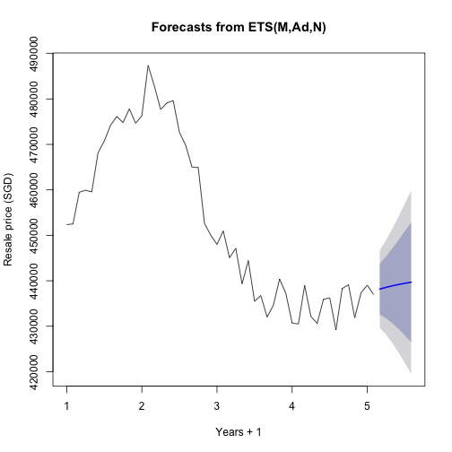
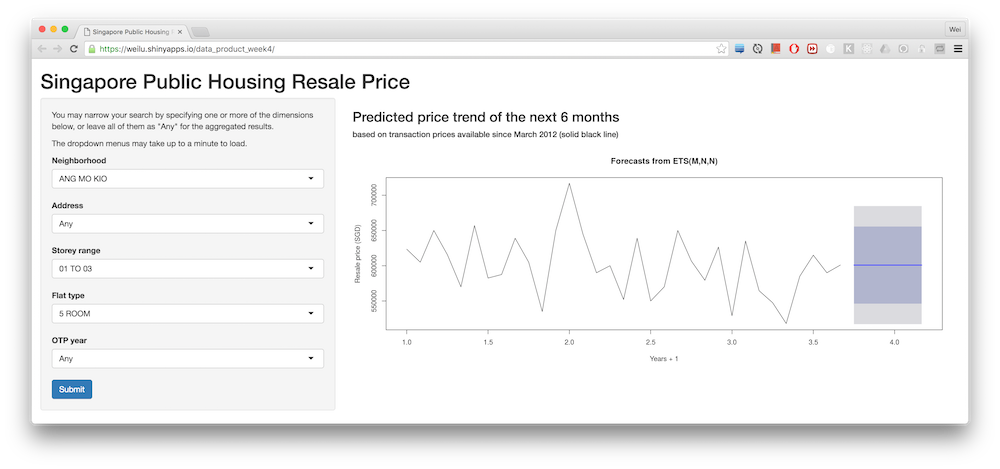

## Objectives

Given Singapore's past HDB resale data, we want to predict the resale price for a given set of requirements like flat type, age, floor, neighbourhood.

## Data Preparation

First we download data from the data source: https://data.gov.sg/dataset/resale-flat-prices, uzip the data and load it into R. The data is already very well formated. We need to convert the `month` column into `yearmon` class for timeseries prediction, and combine `block` and `street_name` into a column named `address` for filtering:


```r
library(zoo)
hdbData <- read.csv("../resale-flat-prices/resale-flat-prices-based-on-registration-date-from-march-2012-onwards.csv")
hdbData$month <- as.yearmon(hdbData$month)
hdbData <- within(hdbData, address <- as.factor(paste(block, street_name)))
hdbData <- hdbData[, -which(names(hdbData) %in% c('block', 'street_name'))]
```

---

## Projection


```r
library(plyr); library(reshape2); library(xts); library(forecast)
id_vars = colnames(hdbData)[colnames(hdbData) != 'resale_price']
datamelt <- melt(hdbData, value.name="resale_price", id.vars=id_vars)
datadcast <- dcast(datamelt, month ~ variable, mean)
datats <- xts(datadcast$resale_price, order.by=datadcast$month)

projection = forecast(ets(datats), 6)
print(projection)
```

```
##       Point Forecast    Lo 80    Hi 80    Lo 95    Hi 95
## Mar 5       438173.2 432581.7 443764.7 429621.7 446724.6
## Apr 5       438548.2 431759.6 445336.8 428165.9 448930.4
## May 5       438882.5 430665.2 447099.7 426315.3 451449.7
## Jun 5       439180.5 429387.8 448973.2 424203.8 454157.2
## Jul 5       439446.2 427988.4 450904.0 421923.0 456969.4
## Aug 5       439683.1 426508.3 452857.8 419534.0 459832.1
```

---

## Plot Projection


```r
plot(projection, ylab='Resale price (SGD)', xlab="Years + 1")
```



---

## Drill-down

Previous plot gives us a simple aggregated projection of the whole Singapore resale market. Certain buyers may already have a potential neiborhood and/or a flat type in mind. This Shiny App provides answers with interactivity: https://weilu.shinyapps.io/data_product_week4/


